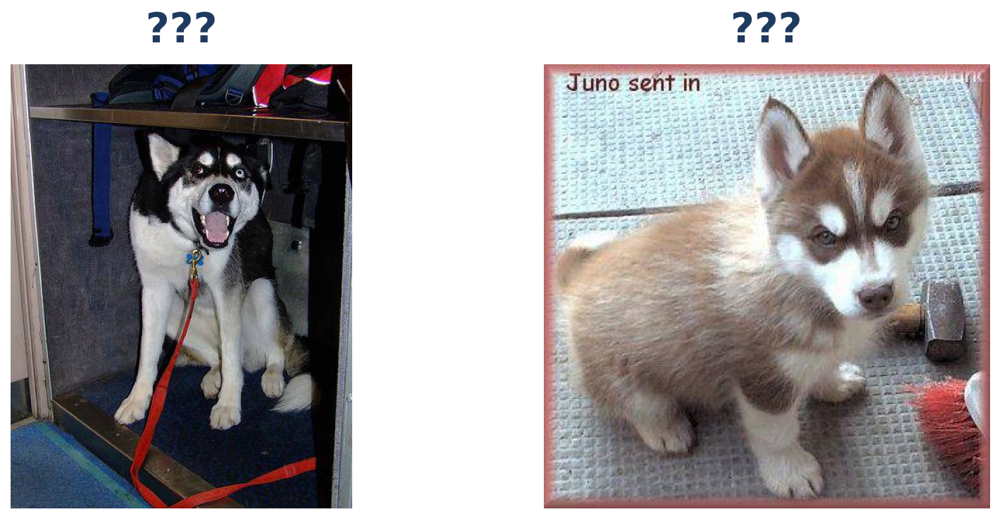
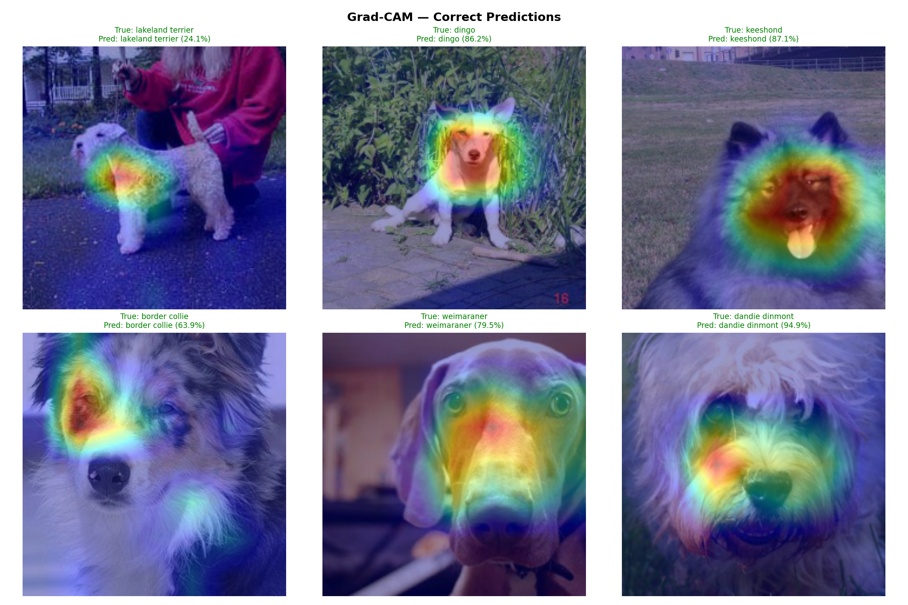
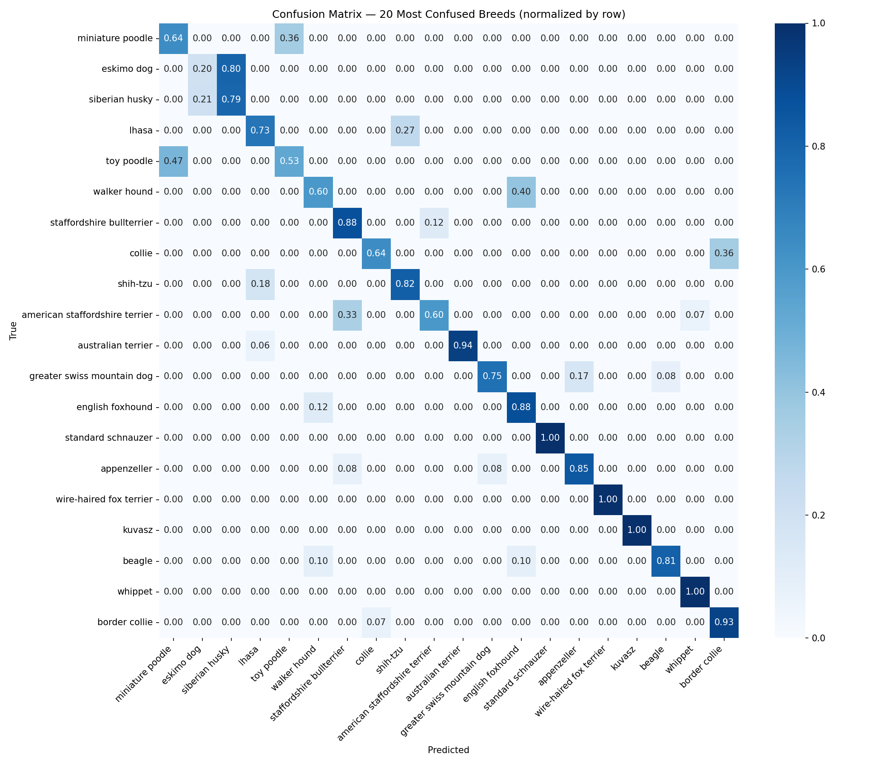
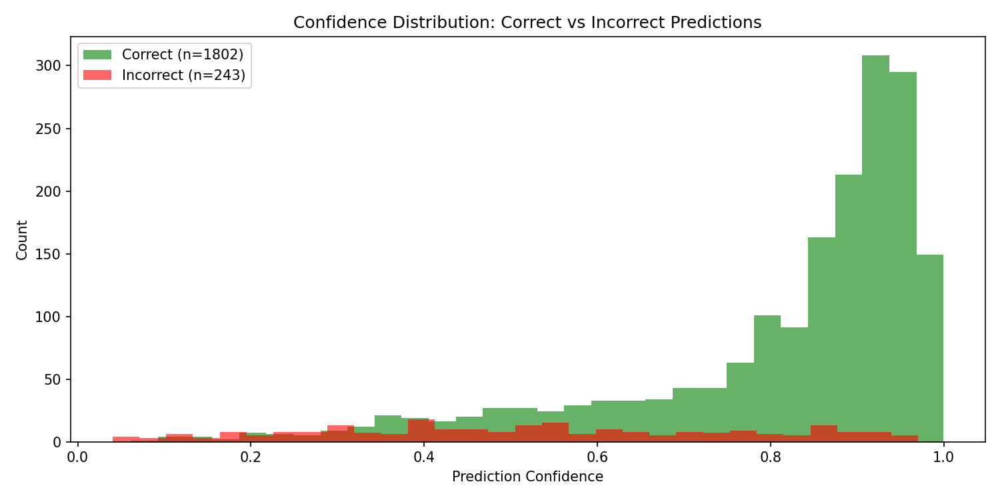

<!-- _paginate: false -->

# 🐕 Dog Breed ID

Identificació de Races de Gossos amb Deep Learning

Guillermo Martínez Batlle

Deep Learning · UAB · Juliol 2026

---

<!-- _paginate: false -->

# Quina diferència veus?

---

## El dataset

10.222

Imatges etiquetades

120

Races de gossos

~85

Imatges per raça

> Font: Kaggle Dog Breed Identification · Split estratificat 80/20

---

## El punt de partida — Baseline CNN

5,04%

Accuracy de validació

Atzar pur: 0,83% (1/120) · ~25.000 paràmetres

---

<!-- _paginate: false -->

# I si li donem a la xarxa uns ulls que ja saben veure?

---

## Transfer Learning — ResNet50 congelat

### El concepte

ResNet50 entrenat amb **1.2M imatges** d'ImageNet

Congelar backbone (23.5M params)
Entrenar només el classificador (1.1M params)

BASELINE

5,04%

→

TRANSFER LEARNING

85,97%

×17 millora

---

## Fine-tuning — El fracàs i la correcció

Fine-tune v1 — 85,13%

Fine-tune v2 — 87,48%

LR backbone: 1e-4 → **1e-5** · Dropout: 0.3 → **0.5**

---

## Label Smoothing — 1 línia de codi

`CrossEntropyLoss(label_smoothing=0.1)`

87,48%
→
88,12%

Gap train-val: 9% → <strong style="color: #22c55e;">5%</strong>

---

## Resum d'iteracions

| Iteració | Canvi clau | Val Acc |
|----------|-----------|:-------:|
| Baseline CNN | — | 5,04% |
| ResNet50 congelat | Transfer learning | 85,97% |
| Fine-tune v1 | Descongelar layer4 | 85,13% |
| Fine-tune v2 | Correcció LR + dropout | 87,48% |
| **+ Label smoothing** | **Suavitzar targets** | **88,12%** |

> Cada iteració canvia **una sola cosa**. Així sabem exactament què funciona.

---

<!-- _paginate: false -->

# Però... què ha après realment el model?

---

## Grad-CAM — On mira el model

El model mira la **cara, orelles, musell i cos** — no el fons

---

## Les confusions tenen sentit

Eskimo dog ↔ Husky · Toy ↔ Miniature poodle · Collie ↔ Border collie

---

## Top-K Accuracy

88,1%

Top-1

97,6%

Top-3

98,5%

Top-5

Quan s'equivoca, la raça correcta quasi sempre és entre les 3 primeres opcions

---

## Calibració — El model sap quan dubta

Correctes: **0,82** confiança · Incorrectes: **0,52** confiança

---

## Conclusions

<strong style="color: #16a34a;">Transfer learning és la clau</strong> — 5% → 86% sense entrenar el backbone

<strong style="color: #dc2626;">Fine-tuning requereix cura</strong> — descongelar ingènuament empitjora el model

<strong style="color: #16a34a;">El model entén les races</strong> — Grad-CAM confirma features rellevants

<strong style="color: #d97706;">98,5% top-5</strong> — quasi sempre té la resposta correcta a prop

---

<!-- _paginate: false -->

Gràcies

# Preguntes?

Guillermo Martínez Batlle

Deep Learning · UAB · Juliol 2026

